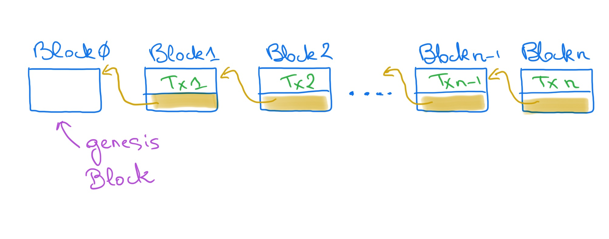
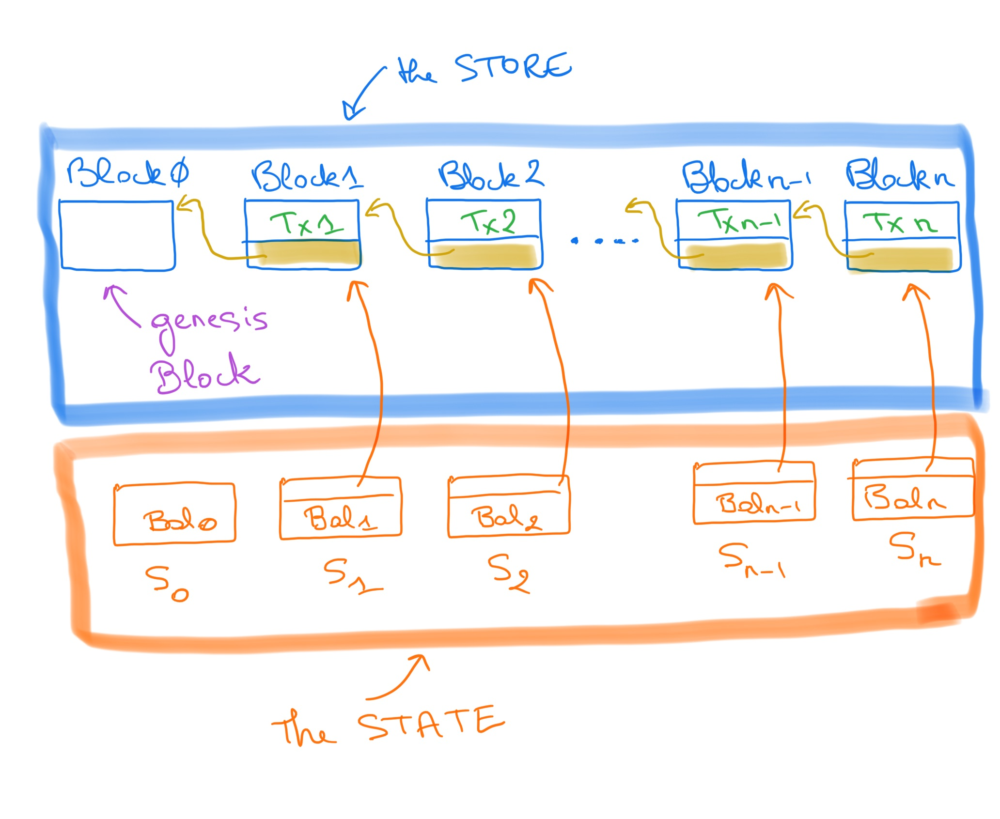

# The Beacon Chain

The **Beacon Chain** is a blockchain that implements a ledger that, among other things, maintains records of transactions of privileged actors of the system, the **validators**. In the sequel we deliberately discuss a simplified version of the Beacon Chain for the sake of clarity. 

We are not concerned with what validators are and we assume that: 

1. there is a **finite number** of them, 
2. they are **account holders**, and each has an initial balance, and 
3. a **transaction** is a request for transfer (ETH) between a source account and a target account that updates the corresponding balances. 

> Note 1. This does not account for the actual transactions of the actual Beacon Chain  but provides a simple context to motivate and explain the techniques and results underlying our work. 

To accept (and execute) a transaction `Tx` (i.e. transfer the ETH) we must check that: 

1. the source and target accounts exist, and 
2. the source account has a balance larger or equal to the amount to be transferred. 

If these two conditions are satisfied, we say that the transaction `Tx` is **valid**. If `Tx` is valid, the ETH transfer can be processed, and we can record the transaction in the ledger. 
`Tx` is appended to the (ordered) sequence of previous transactions. 
To implement the recording of the sequence of transactions we use a standard data structure, 
a _linked list_, the elements of which we call **blocks**. A (beacon) **block** is a pair comprising a transaction and a link to a parent block that contains the previous transaction (except of course the first block, `block 0`, called the _genesis block_ that does not have a parent transaction.) 
Figure 1 depicts the linked list of blocks which is called a **blockchain**, the **Beacon Chain**.
<figure>
    
    <figcaption><strong>Figure 1</strong>: A Block Chain</figcaption>
</figure>

In practice, how do we check that a transaction is **valid**? 
We use the transactions previously recorded in the ledger and replay them from the initial state to determine the current balance of the source account.
This works but can become inefficient when the number of transactions grows very large. 
Moreover there is a huge amount of computations that are performed several times: to check the validity of transaction `Tx n - 1`, we have to compute the balances after the first `n - 2` previous transactions. 
When `Tx n - 1` is accepted, to check that `Tx` n is valid, we will recompute the balances after `n - 2` transactions (what we did to check the validity of `Tx n - 1`) and add the effect of `Tx n - 1`.

 Remember **dynamic programming**? How to cache previously computed results to speed up computations? 
We can track the current balances of each account after each transaction, and instead of recomputing from the beginning, use the most recent balances to check whether a new transaction is valid. 
To do that, we can **store** the balances of the accounts in a table `Bal` (technically a `map`) indicating the current balance of each account. When a valid transaction is recorded, we update the table accordingly. Figure 2 depicts the values, `Bal k`, of the table `Bal`, after the k-th transaction. `Bal 0` maps each account to their initial balance. 

<figure>
    
    <figcaption><strong>Figure 2</strong>: The Store of blocks and the State</figcaption>
</figure> 

The current status of each account can be represented by the value of a variable `Bal`. 
And the sequence of transactions that `Bal` summarises can be captured by a single block, because the blocks are chained. 
The combination of the balances and the sequence of transactions they summarise is completely defined by a (Beacon) **State**. 
A state like `S0, S1, ... , Sn` in Figure 2, is a pair (in reality a tuple or container in the Beacon Chain terminology) that holds the value of `Bal` and an entry point to a block in the `Store`. 
As a result the Beacon Chain is a **state machine**: accepting a new transaction `Tx` in a given state `S` amounts to 

1. checking whether `Tx` is valid in S, and
2. if yes, update the `Store` and the `State` accordingly

Assume the transaction to add is `Tx n` anbd the current state is `S (n - 1)`.
The updates require: 

1. adding to the `Store` a block `Block n`, containing `Tx n` and link it to the previous block `Block (n - 1)` that is the entry point of the current state `S (n - 1)` (see Figure 2), 
2. update the state to `S (n - 1)` to `S n` with the new balances and the entry point `Block n`. 
