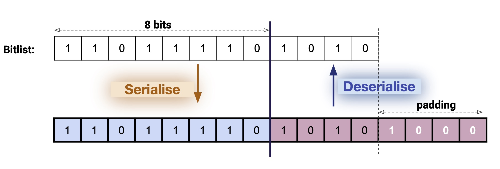

# Simple SerialiZe (SSZ) Library

This section contains notes about the Eth2.0 specifications of SSZ and links to the corresponding formal definitions and correctness proofs in **Dafny**.

**Disclaimer**: It is not the official SSZ specs.

## Overview

The SSZ functions aims at providing the following functionalities:

1.  _serialise_, encode data structures as sequences of bytes,  and 
2.  _deserialise_, decode sequences of bytes to reconstruct a given data structure.

Given an object `O`, its serialised version, `serialise(O)`, is a finite sequence of bytes.
Conversely, given a finite sequence of bytes `xs`, and a data structure's type `Tipe`, `deserialise(xs)` should reconstruct, when possible,  an object of type `Tipe` from the given sequence of bytes.

## Background

An object that can be serialised is of type `Serialisable` in SSZ (`Serialisable` can be thought of as a trait.)
Given a type `T`, we write  `T <: Serialisable` if `T` extends (or "inherits" or "is a") `Serialisable`.

Each type `T <: Serialisable` should offer the two functionalities described above:

* `serialise<T> : T --> seq<bytes>`, a total function that returns a sequence of bytes when applied to an object of type `T`, 
 
* and `deserialise<T> : seq<bytes>  ~-> T`, a partial function  that
returns an object of type `T` **when it is possible to deserialise a sequence of bytes  in an object of type `T`**.
Indeed, `deserialise<T>` may not be defined for some sequences `xs` (see below for concrete cases.)
 
How objects of type `T <: Serialisable` are serialised and deserialised is explained in the sequel.

## Expected Properties of Serialise/Deserialise

Given two objects `O1:T`, `O2:T` (read "Oi of type T") where `T <: Serialisable`, the pair of functions `(serialise<T>, deserialise<T>)` should be:

* **Involutive**: `deserialise<T>( serialise<T>(O1) ) = O1`,
* **Injective**: `serialise<T>(O1) = serialise<T>(O2)` implies that `O1 = O2`.

## SSZ in Eth2  

In the Eth2.0 specifications, SSZ provides serialisation and deserialisation for

* **Basic types** i.e. integers, Booleans,
* **List** and **vectors of bits**, known as BitLists and BitVectors,
* **Lists** and **vectors** of `Serialisable`,
* **Containers** with `Serialisable` fieds,
* and Unions that we omit in this project.

In the sequel we introduce formal specifications for the corresponding serialisation and deserialisation functions.

## Formal Specifications, Implementations and Correctness Proofs

We write the specifications and implementations of the serialisation/deserialisation functions using **logical pre-conditions** to define the domain of each function.
Moroever, in the correctness proofs, we use provable **logical post-conditions** to establish the correctness properties. 

### Booleans

Booleans are probably the simplest `Serialisable` to serialise and deserialise.
The Boolean value `true` (resp. `false`) is serialised into a byte of value `1` (resp. `0`).
Note that this implies that the co-domain of `serialise<Booleans>` is the set of bytes `{0,1}`. As a result the domain of `deserialise<Booleans>` must be `{0,1}`. 

The complete formal Dafny definition is available [in this file](https://github.com/PegaSysEng/eth2.0-dafny/blob/master/src/dafny/ssz/BoolSeDes.dfy) that contains:

 * the **functional specifications** of `serialise<Booleans>` and `deserialise<Booleans>` and,
 * the **implementations** that are the **executable functional versions** of the specifications.

Technically in Dafny, a `function` is a specification and does not need to have an implementation.
However, it is possible to make a function executable using the `function method` type.


### Unsigned Integers

The Eth2.0 specifications restrict unsigned integers to a finite number of cases:
`uintN`: `N`-bit unsigned integer, where `N` in `{8, 16, 32, 64, 128, 256}`.
The serialisation of `uintN` is defined using the Python (3?) version of `int.to_bytes`, little-endian.

We provide here a language-agnostic definition of the serialisation of an unsigned mathematical integer (unbounded) over a number of bytes, and later specialise for the Eth2.0 `uintN`.

Given a unsigned integer, i.e. a natural number `n`, and `k` another natural number which is the number of bytes to serialise `n`, we define `serialise<nat>(n, k)` recursively, and only for values of `k` such k-bytes can accommodate the bitvector representation of `n`.

If follows that we must have `n < 2^(8 * k)` to be able to encode `n` over `k` bytes.
Hence `serialise<nat>(n, k)` is only defined for values `n, k` such that  `n < 2^(8 * k)`.

The serialisation of `n` over `k` bytes is defined inductively as follows:

```
function serialise<nat>(n: nat, k: nat) : seq<byte>
  //    Pre-condition
  requires n < power2(8 * k) 
{
  if ( k == 1 ) then  
    //  n's bitvector representation fits in a single byte
    [n as byte]
  else 
    //  Compute bitvector representation for n % 256 and append
    //  serialisation of the remaining bits.
    [(n % 256) as byte] + uintSe( n / 256, k - 1)
}
```

In other words, if `b[k]b[k-1] ... b[0]` is the little-endian bitvector representation of `n` over  
`8 * k` bits, then `serialise<nat>(n,k) = b[0]b[1] ... b[k]`.  
The complete formal Dafny definition is available [in this file](https://github.com/PegaSysEng/eth2.0-dafny/blob/master/src/dafny/ssz/IntSeDes.dfy) along with the proof that the previous algorithm always terminate.
Serialisation for `uintN`, where `N` in `{8, 16, 32, 64, 128, 256}` are special cases of the previous
function.

Deserialising a sequence of bytes `xb` into an unsigned integer works as expected by interpreting `xb` as the reversed sequence of the bitvector representation of a natural number: there must be at least one byte to deserialise, and the result will be an unsigned integer less than `2^( 8 * |xb|)`:

```
function deserialise<nat>(xb : seq<byte>) : nat
    requires |xb| >= 1
    ensures uintDes(xb) < power2(8 * |xb|) 
{
    if ( |xb| == 1 ) then 
        xb[0] as nat
    else 
        (xb[0] as nat) + 256 * uintDes(xb[1..])
}
```

Note that deserialising a sequence of bytes `xb` into `uintN`, where `N` in `{8, 16, 32, 64, 128, 256}` requires special checks to make sure the target type can represent the bitvector values given by `xb`. 
For instance, `deserialise<uint8>`'s domain is the set of sequences `xb` of length `1`.
More generally,  `deserialise<uintk>`'s domain is the set of sequences `xb` of length `|xb| * 8 = k`.

The complete formal Dafny definition of the serialisation/deserialisation for  `uintN` is available [in this file](https://github.com/PegaSysEng/eth2.0-dafny/blob/master/src/dafny/ssz/Serialise.dfy) along with the proof of involution.

Note that the main `deserialise` function (and implementation) returns a `Try<Serialisable>` which is
(as in other languages) either a `Success<Serialisable>` if the computation succeeds or a `Fail` if the conversion cannot be computed.
The lemma `wellTypedDoesNotFail` establishes that when a sequence of bytes is in the domain 
of a `deserialise<T>` function, it does not fail.
The lemma `seDesInvolutive` (resp. `serialiseIsInjective`)  formally establishes the involutive (resp. injective) property mentioned previously.

### Bitlists

The official definition of serialise for bitlists is available [here](https://github.com/ethereum/eth2.0-specs/blob/dev/ssz/simple-serialize.md#bitlistn).

A bitlist is a list of Boolean values.
In this section, we adopt a more functional approach and we define what the encoding of a bitlist is.
The main idea in the serialisation part is to encode a bitlist in a sequence of bytes by chopping it into chunks of size 8 (the number of bits in a byte).
However, a bitlist may not have a size that is a multiple of 8, so it is necessary to somehow encode the actual size or last element of the list in the serialisation.

The serialisation/deserialisation process is illustrated below. 




Given a bitlist (size of which is not necessarily a multiple of 8), a sentinelle `true` (or `1`) is added to the list, and the resulting list is further padded with `0` to obtain a list of size multiple of 8. The number of bytes necessary to encodea bitlist of size `n` is thus the smallest multiple of 8 larger than `n + 1`. 

To deserialise a sequence of bytes `xb` into a bitlist, concatenate the bits in each byte and remove the tail `1 0*`.

The functional specifications, implementations and proofs (involutive and injective) are availabel in [this file](https://github.com/PegaSysEng/eth2.0-dafny/blob/master/src/dafny/ssz/BitListSeDes.dfy).
Note that the co-domain of `serialise<bitlist>` is the set of sequences of bytes of length at least `1`, and the last byte must contain at least one bit set to `1`.
A consequence is that the domain of `deserialise<bitlist>` is restricted to sequences of at least one byte, such that the last byte is not `0x00`.

## Bitvectors
TODO


## Lists
TODO

## Vectors
TODO

## Containers
TODO